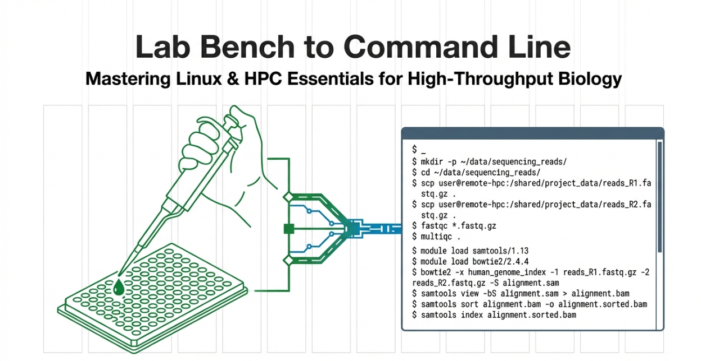
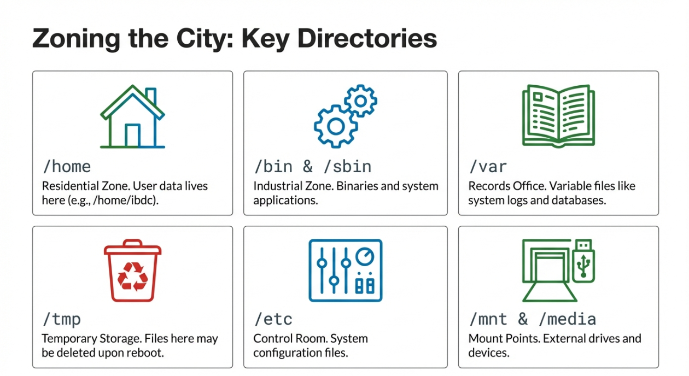
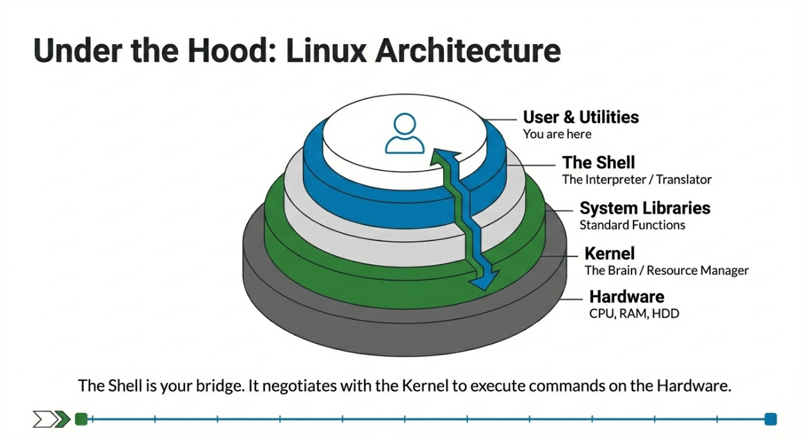
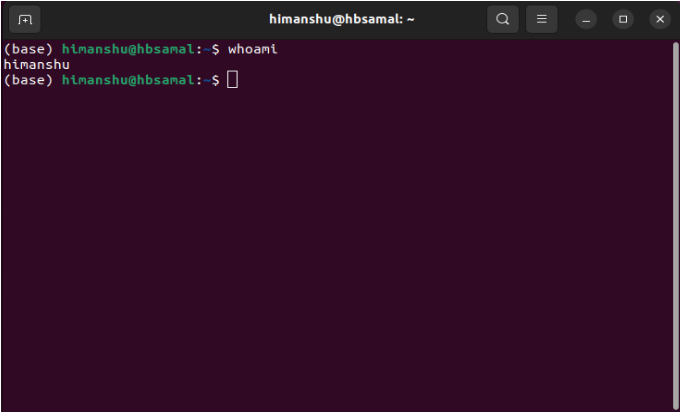

# Linux & HPC: A Quick Guided Tour

## Syllabus Overview
* Introduction
* Importance of Linux
* Architecture of Linux
* The Terminal
* Linux File Hierarchy Structure
* The Linux Shell
* Navigating the filesystem
* File Operations
* Working with text
* Combining commands (awk, sed, grep)
* Shell script
* Shell Programming
* Installation of Tools
* Linux Command Reference

***HPC:***

* Introduction
* HPC System Architecture
* Login to IBDC-HPC
* IBDC-HPC functionalities
* Installation of Tools
* PBS script and Job management

---






## Introduction
With the avant-garde technologies and constant evolution of scientific knowledge, biologists are faced with an increasing need for bioinformatics skills to deal with high-throughput data storage, retrieval, and analysis. Although several resources developed for such tasks have a graphical user interface, many operations can be more efficiently handled with command-line programs and utilities.

The Linux shell is both a command-line interface (CLI) and a scripting language, allowing tasks to be done automatically and quickly. With the proper commands, the shell can repeat tasks with or without some modification as many times as we want.


**A brief history of Linux**

Linux is an operating system that evolved from a kernel created by Linus Torvalds when he was a student at the University of Helsinki in 1991. When Linus Torvalds was studying at the University of Helsinki, he was using a version of the UNIX operating system called 'Minix'. Linus and other users sent requests for modifications and improvements to Minix's creator, Andrew Tanenbaum, but he felt that they weren't necessary. That's when Linus decided to create his own operating system that would take into account users' comments and suggestions for improvements. 

**Introduction**

Linux is a family of free and open-source operating systems based on the Linux kernel. The Linux Kernel is like the brain of the operating system because it manages how the computer interacts with its hardware and resources. But the Linux Kernel alone is not enough to make a complete operating system. To create a full and functional system, the Linux Kernel is combined with a collection of software packages and utilities, which are together called Linux distributions. These distributions make the Linux Operating System ready for users to run their applications and perform tasks on their computers securely and effectively. Operating systems based on Linux are known as Linux distributions or distros. Examples include Debian, Ubuntu, Fedora, CentOS, Gentoo, Arch Linux, Red Hat Enterprise Linux (RHEL), and many others.

**Importance of Linux**

Linux is a free, open-source operating system known for its flexibility, stability, and strong security. It is widely used in personal computing, server environments, and enterprise systems because of its performance and customization capabilities.

- ==Offers high security and stability, making it ideal for servers and development work.==
- ==Fully open-source and free to use, modify, and distribute.==
- ==Highly flexible and customizable to suit different user and industry needs.==
- ==Supported by a large global community and a vast software ecosystem.==


**Architecture of Linux**
Linux architecture refers to the layered structure of the Linux operating system that defines how its components - such as the kernel, shell, system libraries, and hardware interact with each other to manage system resources and execute user programs efficiently.



1. Kernel: The kernel is the core of the Linux operating system that manages hardware resources and controls communication between software and hardware. Handles process management, memory, and device control. Prevents conflicts between multiple running programs.
2. System Libraries: System libraries provide essential functions that allow applications to interact with the kernel without needing to access it directly. These libraries contain pre-written code that applications can use to perform specific tasks. By using these libraries, one can save time and effort, as they don’t need to write the same code repeatedly. System libraries act as an interface between applications and the kernel, providing a standardized and efficient way for applications to interact with the underlying system.

3. Shell: The shell is the command-line interface that allows users to communicate with the operating system by entering commands. It interprets and executes user commands and serves as a bridge between the user and the kernel, forwarding the user’s requests to the kernel for processing. It provides a convenient way for users to perform various tasks, such as running programs, managing files, and configuring the system.

4. Hardware Layer: The hardware layer consists of physical components that execute commands and provide system resources. It includes RAM (Random Access Memory), HDD (Hard Disk Drive), CPU (Central Processing Unit), and input/output devices. This layer is responsible for interacting with the OS and providing the necessary resources for the system and applications to function properly. The Linux kernel and system libraries enable communication and control over these hardware components, ensuring that they work harmoniously together.

5. System Utility: System utilities are essential tools and programs provided by the Operating System to manage and configure various aspects of the system. These utilities perform tasks such as installing software, configuring network settings, monitoring system performance, managing users and permissions, and much more. System utilities simplify system administration tasks, making it easier for users to maintain their Linux systems efficiently.
---

## The Terminal

The terms “terminal,” “shell,” and “command line interface” are often used interchangeably, but there are subtle differences between them.

- ==A shell is a program that exposes the computer’s operating system to a user or program. In Linux systems, the shell presented in a terminal is a command line interpreter.==
- ==A terminal is an input and output environment that presents a text-only window running a shell.==
- ==A command line interface is a user interface (managed by a command line interpreter program) which processes commands to a computer program and outputs the results.==

When it refers to one of these three terms in the context of Linux, it generally means a terminal environment where users can run commands and see the results printed out to the terminal.



The terminal is interactive: users can specify commands to run and the terminal outputs the results of those commands. To execute any command, users need to type it into the prompt and press ENTER.

When accessing a cloud server, most often it is accessed through a terminal shell. Although personal computers that run Linux often come with the kind of graphical desktop environment familiar to most computer users, it is often more efficient or practical to perform certain tasks through commands entered into the terminal.

**Linux File Hierarchy Structure**

The Linux File Hierarchy Structure or the Filesystem Hierarchy Standard (FHS) defines the directory structure and directory contents in Unix-like operating systems. It is maintained by the Linux Foundation. Nearly all Linux distributions are compliant with this universal standard filesystem directory structure. The FHS defines a set of directories, each of which serve their own special function.

The forward slash (/) is used to indicate the root directory in the filesystem hierarchy defined by the FHS, all files and directories appear under the root directory /, even if they are stored on different physical or virtual devices.

When a user logs in to the shell, they are brought to their own user directory, stored within **/home/**. This is referred to as the user’s *home directory*. The FHS defines **/home/** as containing the home directories for regular users.

The **root** user has its own home directory specified by the FHS: **/root/**. Note that / is referred to as the **“root directory”**, and that it is different from **root/**, which is stored within /.

Because the FHS is the default filesystem layout on Linux machines, and each directory within it is included to serve a specific purpose, it simplifies the process of organizing files by their function. The following is a listing of common directories that are directly under the root (/) directory:


| Directory | Description |
| :--- | :--- |
| `/bin` | important binary applications |
| `/boot` | boot configuration files, kernels, and other files needed at boot time. |
| `/dev` | System device files. |
| `/etc` | configuration files, startup scripts, etc. |
| `/home` | List of home directories for different users |
| `/lib` | system libraries, shared libraries |
| `/lost+found` | a lost+found system for files that exist under the root (/) directory |
| `/media` | automatically mounted (loaded) partitions on your hard drive and removable media such as CDs, digital cameras, etc. |
| `/mnt` | manually mounted filesystems on your hard drive |
| `/opt` | 3rd part applications to be installed |
| `/proc` | Maintains information about the state of the system, including currently running processes. |
| `/root` | root user's home directory. |
| `/sbin` | important system binaries |
| `/srv` | contain files that are served to other systems |
| `/sys` | system files |
| `/tmp` | temporary files |
| `/usr` | applications and files that are mostly available for all users to access |
| `/var` | variable files such as logs and databases |

## The Linux Shell

### Running Commands
When the shell is first opened, you are presented with a prompt, indicating that the shell is waiting for input. A typical prompt on Linux may look like this: 

`username@hostname:~$`

* **username** represents the username of the current user.
* **hostname** represents the name of the computer or system.
* **~** represents the current directory (in this case, the home directory).
* **$** is the command prompt symbol, indicating that the shell is ready to accept commands.

After you type a command, you have to press the **Enter ↲** key to execute it. So let’s try our first command, `ls` which is short for “listing”. This command will list the contents of the current directory.

### Command Options
Commands can often change their behaviour with additional options. Consider the command below as a general example, which we will dissect into its component parts:
`ls  -l  --sort  time  Documents/`

* **ls** is the command.
* **-l** is an argument that “switches on” a particular behaviour of the program. In this case it lists the files in a “long” format. These kind of arguments are also called an option, switch or flag. Options either start with a single dash (`-`) or two dashes (`--`).
* **--sort** is also an argument, but it needs a value to indicate how it should change the behaviour of the program. In this case, the option changes how the files are sorted (in our example we specified ‘time’ to sort files by the time they were created or modified).
* **Documents** is a positional argument, which comes at the end of the command. This argument tells the command what to operate on (e.g. files and directories).

A command can be called with more than one option and more than one argument: but a command doesn’t always require an argument or an option.

Each part is separated by spaces: if you omit the space between `ls` and `-l` the shell will look for a command called `ls-l`, which doesn’t exist. Also, capitalisation can be important: `ls -r` is different to `ls -R`.

So, our command above gives us a long listing of files and directories in the directory `Documents`.

### Getting help
`ls` has lots of other options. There are two common ways to find out how to use a command and what options it accepts:

1.  We can pass a `--help` option to the command, such as `ls --help`.
2.  We can read its manual with `man`, such as `man ls`. To exit the man page you can type `q` (for “quit”).


> ### Summary
> * The **Linux shell (command line)** allows running complex operations with a few commands, interacting with **high-performance computing servers**, and writing reproducible analysis in scripts.
> * The **basic syntax** of a command is: `command -options argument`.
> * For example: `ls -l Documents` would list the contents of the Documents directory in a **long format**.
> * To find the options available with a given program, we can use the `--help` function or (in some cases) the `man` command. 
> * For example: `ls --help` or `man ls`.


## 2. Navigating the filesystem

### Learning Objectives
* Understand the hierarchical structure of filesystems and how the location of files and directories is specified.
* Distinguish between absolute and relative paths.
* Recognise when / is used to specify the root directory or to separate directories.
* Navigate the filesystem using the commands `pwd`, `ls` and `cd`.
* Make use of the `*` wildcard to match files by patterns.
* Use the `find` command to effectively search for files or directories.

### Linux Filesystem
The part of the operating system responsible for managing files and directories is called the filesystem. It organizes our data into files and directories (also called folders), which hold files or other directories. These directories are organised in a hierarchical way, which we can represent as a tree.


This is illustrating the location of the home directories for three users called “ibdc”, “rcb” and “ucsd”. We can see that each of their home directories is within another directory called home. And finally, the home directory is located in the root of the filesystem, represented by a / slash. The root is the top-most directory where everything for our operating system is stored in (it’s not possible to go “above” this special root directory).


When we use the shell, we need to specify the location of files and directories using an “address” (similarly to how you specify an internet address to reach a given website). Let’s explore this from our shell terminal.

First let’s find out where we are by running a command called pwd (which stands for “print working directory”). Directories are like places - at any time while we are using the shell we are in exactly one place, called our current working directory. Commands mostly read and write files in the current working directory, so knowing where you are before running a command is important.

pwd
/home/ibdc


Here, the computer’s response is /home/ibdc, which is the home directory, the default when opening a new shell terminal. The name “ibdc” is the username.
If the user “rcb” was logged in, they would see /home/rcb as their default working directory.
Notice how the location of this folder is specified:
/ at the start specifies the root of the filesystem.
home specifies the folder “home” within the root.
/ is a separator between the “home” folder and the next folder.

The way of representing file or directory locations is called a path.
The / slash - Notice that there are two meanings for the / character. When it appears at the beginning of a file or directory name, it refers to the root directory. When it appears inside a name, it’s a separator.
Home directory variation - The home directory path will look different on different operating systems. For a user named “ucsd”, on a Mac it would look like /Users/ucsd, and on Windows C:\Users\ucsd.
Listing files: We can see the content of our current directory by running ls, which stands for “listing”:

Changing Directory: The command to change locations is cd (“change directory”) followed by a directory name to change our working directory.
cd /home/ibdc/data
We can check with pwd that we are in the correct directory. We can also run ls again to see the files within our current directory.
There are two ways to specify directory names:
An absolute path includes the entire path (or location) from the root directory, which is indicated by a leading slash. The leading / tells the computer to follow the path from the root of the filesystem, so it always refers to exactly one directory, no matter where we are when we run the command.
A relative path tries to find that location from where we are (our current directory), rather than from the root of the filesystem.
The shell interprets the character ~ (tilde) at the start of a path to mean “the user’s home directory”. In our example the ~ is equivalent to /home/ibdc.
We now know how to go down the directory tree, but how do we go up? cd can only see sub-directories inside your current directory. To move up one directory we need to use the special shortcut .. like this: cd ..

Wildcards: Wildcards are special characters that can be used to access multiple files at once. The most commonly-used wildcard is *, which is used to match zero or more characters.


*.pdb matches every file that ends with ‘.pdb’ extension.
Another common wildcard is ?, which matches any character exactly once.
Finding Files: Often, it’s useful to be able to find files that have a particular pattern in their name. We can use the find command to achieve this. Here is an example, where we try to find all the text files that exist in the working folder:
find . -type f -name "*.txt"
In this case, we used the option -type f to only find files with the given name. We could use the option -type d if we wanted to instead find directories only. If we wanted to find both files and directories, then we can omit this option.
We used -name to specify the name of the file we wanted to search for. Similarly to ls, you can use the * wildcard to match any number of characters. In our example, we used *.txt to find all files with the .txt file extension.
Finally, we searched for files from the current location we were in. That’s what the . in the command above means: search for files from the current directory. If we wanted to find files in a different directory without having to cd into it first, we could replace . with the name/path of the directory we want to search from. 
One option that can sometimes be useful is to find and delete all the files. For example, the following command would delete all files with .txt extension:
find . -type f -name "*.txt" -delete
As you can imagine, this feature is very useful but also potentially dangerous as you may accidentally delete files you didn’t intend to. So, always make sure to run the command without the -delete option first to check that only the files you really want to delete are being matched.

!!! tip ### " Summary"

* The filesystem is organised in a hierarchical way.
* Every user has a home directory, which on Linux is `/home/username/`.
* Locations in the filesystem are represented by a **path**:
     * The `/` used at the start of a path means the **“root”** directory (the start of the filesystem).
     * `/` used in the middle of the path separates different directories.
 * Some of the commands used to navigate the filesystem are:
     * `pwd` to print the working directory (or the current directory)
     * `ls` to list files and directories
     * `cd` to change directory
 * Directories can be created with the `mkdir` command.
 * Files can be moved and/or renamed using the `mv` command.
 * Files can be copied with the `cp` command. To copy an entire directory (and its contents) we need to use `cp -r` (the `-r` option will copy files recursively).
 * Files can be removed with the `rm` command. To remove an entire directory (and its contents) we need to use `rm -r` (the `-r` option will remove files recursively).
 * **Deleting files from the command line is permanent.**
 * We can operate on multiple files using the `*` **wildcard**, which matches “zero or more characters”. For example `ls *.txt` would list all files that have a `.txt` file extension.
 * The `find` command can be used to find the location of files matching a specific name pattern.

---

## 3. File Operations

### Learning Objectives

* Distinguish between copying and moving files.
* Recognise how accidental and irreversible data loss may occur when moving or copying files.
* Create, move, copy and remove files and directories using the commands `mkdir`, `mv`, `cp`, `rm` and `rmdir`.

### Creating directories
We now know how to explore files and directories, but how do we create them in the first place? First, we should see where we are and what we already have. Let’s go to one directory and use `ls` to see what it contains:

```bash
cd ~/ibdc_workshop/working_files/
ls

Now, let’s create a new directory called test_files using the command mkdir (“make directory”):
Bash
mkdir test_files

The new directory is created in the current working directory and use ls to see the contents.
Note that using the shell to create a directory is no different than using a file explorer. If you open the current directory using your operating system’s graphical file explorer, the results directory will appear there too. While the shell and the file explorer are two different ways of interacting with the files, the files and directories themselves are the same.

> ### Good naming conventions in linux
>
> Complicated names of files and directories can make your life painful when working on the command line.
> Here are some useful tips for naming your files:
>
> * **Don’t use spaces.**
>   Spaces can make a name more meaningful, but since spaces are used to separate arguments on the command line it is better to avoid them in names of files and directories. You can use - or _ instead (e.g. `test_files/` rather than `test files/`).
> * **Don’t begin the name with - (dash).**
>   Commands treat names starting with - as options.
> * **Only use letters, numbers, . period, - hyphen and _ underscore.**
>   Many other characters (such as !, @, $, ", etc.) have special meanings on the command line and can cause your command to not work as expected or even lead to data loss.
> * **If you need to refer to names of files or directories that have spaces or other special characters, you should surround the name in quotes (" ").**


Markdown
### Moving & Renaming
In our `~/ibdc-workshop/test_data/` directory we have a file called `6M0J.pdb`, which is a crystal structure file of SARS-CoV-2 spike receptor-binding domain bound with human ACE2 protein. Let’s move this file to the `working_data/` directory we created earlier, using the command `mv` (“move”):

```bash
mv 6M0J.pdb ../working_data/


The first argument tells mv what we’re “moving”, while the second is where it’s to go. In this case, we’re moving 6M0J.pdb to working_data/. We can check the file has moved there:
Bash
ls ../working_data/


If this is not an informative name for our file we can change the name by using the mv command. Here’s how we could change a file’s name:
Bash
mv ../working_data/6M0J.pdb ../working_data/Spike-RBD_6M0J.pdb


In this case, we are “moving” the file to the same place but with a different name. Be careful when specifying the target file name, since mv will silently overwrite any existing file with the same name, which could lead to data loss.
The command mv also works with directories, and you can use it to move/rename an entire directory just as you use it to move an individual file.

Copying Files and Directories
The cp command works very much like mv, except it copies a file instead of moving it. For example, let’s make a copy of our .pdb file:
Bash
cp ~/ibdc-workshop/working_data/Spike-RBD_6M0J.pdb 6M0J_copy.pdb


Copy a File: cp source_file.txt destination_file.txt
Copy File to Directory: cp file.txt /path/to/folder/
Copy Directory (Recursive): cp -r source_dir destination_dir
Copy Multiple Files: cp file1.txt file2.txt /destination/folder/
Preserve Attributes: cp -a source/ destination/ (preserves structure, permissions, and timestamps)
Verbose Mode: cp -v (shows files as they are copied)
Prompt Before Overwriting: cp -i
Copying within the same directory: cp file.txt file_copy.txt
Copying to a different directory: cp file.txt /home/user/documents/
Copying the contents of a folder: cp -r dir1/* dir2/

Removing Files and Directories
The Unix command used to remove or delete files is rm (“remove”). For example, let’s remove one of the files we copied earlier:
Bash
rm 6M0J_copy.pdb


We can confirm the file is gone using ls. What if we try to remove the whole test_dir/ directory we created earlier:
Bash
rm test_dir/
# rm: cannot remove 'test_dir/': Is a directory


We get an error. This happens because rm by default only works on files, not directories.
rm can remove a directory and all its contents if we use the recursive option -r, and it will do so without any confirmation prompts:
Bash
rm -r test_dir/


Given that there is no way to retrieve files deleted using the shell, rm -r should be used with great caution (you might consider adding the interactive option rm -r -i).
To remove empty directories, we can also use the rmdir command. This is a safer option than rm -r, because it will never delete the directory if it contains files, giving us a chance to check whether we really want to delete all its contents.

> ### Summary
> 
> * Directories can be created with the `mkdir` command.
> * Files can be moved and/or renamed using the `mv` command.
> * **Data loss warning:** If files of the same name exist in the destination, they will be overwritten.
> * Files can be copied with the `cp` command.
> * To copy an entire directory (and its contents) we need to use `cp -r` (the `-r` option will copy files recursively).
> * **Data loss warning:** If files of the same name exist in the destination, they will be overwritten.
> * Files can be removed with the `rm` command. To remove an entire directory (and its contents) we need to use `rm -r` (the `-r` option will remove files recursively).
> * **Data loss warning:** Deleting files from the command line is permanent.


# Linux Command Reference

## File Commands
| # | Command | Description |
| :--- | :--- | :--- |
| 1 | `ls` | Directory listing |
| 2 | `ls -al` | Formatted listing with hidden files |
| 3 | `ls -lt` | Sorting the Formatted listing by time modification |
| 4 | `ls -ltr` | Shows the files in the long listing format in reverse sorted by modification time |
| 5 | `cd <dir>` | Change directory to dir |
| 6 | `cd` | Change to home directory |
| 7 | `pwd` | Show current working directory |
| 8 | `mkdir <dir>` | Creating a directory dir |
| 9 | `cat` | Display the content of a file, copy content from one file to another, or concatenate multiple files |
| 10 | `more` | View the contents of a file one screen at a time (permits forward scrolling) |
| 11 | `less` | View the contents of a file one screen at a time (forward and backward navigation) |
| 12 | `head` | Output the first 10 lines of the file |
| 13 | `tail` | Output the last 10 lines of the file |
| 14 | `tail -f <file>` | Output the contents of file as it grows, starting with the last 10 lines |
| 15 | `touch` | Create or update file |
| 16 | `rm` | Deleting the file |
| 17 | `rm -r` | Deleting the directory |
| 18 | `rm -f` | Force to remove the file |
| 19 | `rm -rf` | Force to remove the directory |
| 20 | `cp` | Copy the file |
| 21 | `cp -r` | Copy the entire directory |
| 22 | `mv` | Rename or moving file |

## Process Management
| # | Command | Description |
| :--- | :--- | :--- |
| 1 | `ps` | To display the currently working processes |
| 2 | `top` | Display all running process |
| 3 | `kill <pid>` | Kill the process with given pid |
| 4 | `pkill <pattern>` | Will kill all processes matching the pattern |
| 5 | `bg` | List stopped or background jobs; resume a stopped job in the background |
| 6 | `fg` | Brings the most recent job to foreground |

## File Permission
| Command | Description |
| :--- | :--- |
| `chmod` | Change the permission of file to octal. Sum values for User, Group, and World: |
| | • **4** - read (r) |
| | • **2** - write (w) |
| | • **1** - execute (x) |


## Searching
| # | Command | Description |
| :--- | :--- | :--- |
| 1 | `grep <pattern> <file>` | Search for pattern in file |
| 2 | `grep -r <pattern> <dir>` | Search recursively for pattern in dir |
| 3 | `command \| grep <pattern>` | Search pattern in the output of a command |
| 4 | `pgrep <pattern>` | Searches for all named processes matching the pattern and returns their ID |
| 5 | `locate <file>` | Find all instances of file |

## System Info
| # | Command | Description |
| :--- | :--- | :--- |
| 1 | `date` | Show the current date and time |
| 2 | `cal` | Show the present month's calendar |
| 3 | `uptime` | Show current uptime |
| 4 | `w` | Display who is online |
| 5 | `whoami` | Who you are logged in as |
| 6 | `finger <user>` | Display information about user |
| 7 | `uname -a` | Show kernel information |
| 8 | `cat /proc/cpuinfo` | CPU information |
| 9 | `man <command>` | Show the manual for command |
| 10 | `df -h` | Show disk usage in human-readable format |
| 11 | `du -sh` | Show directory space usage |
| 12 | `free` | Show memory and swap usage |
| 13 | `whereis <tool>` | Show possible locations of tool |
| 14 | `which <tool>` | Show which application will be run by default |

## Compression
| # | Command | Description |
| :--- | :--- | :--- |
| 1 | `tar cf file.tar file` | Create tar named file.tar containing file |
| 2 | `tar xf file.tar` | Extract the files from file.tar |
| 3 | `tar czf file.tar.gz files` | Create a tar with Gzip compression |
| 4 | `tar xzf file.tar.gz` | Extract a tar using Gzip |
| 5 | `tar cjf file.tar.bz2` | Create tar with Bzip2 compression |
| 6 | `tar xjf file.tar.bz2` | Extract a tar using Bzip2 |
| 7 | `gzip file` | Compresses file and renames it to file.gz |
| 8 | `gzip -d file.gz` | Decompresses file.gz back to file |

## Network
| # | Command | Description |
| :--- | :--- | :--- |
| 1 | `ping host` | Ping host and output results |
| 2 | `whois domain` | Get whois information for domains |
| 3 | `dig domain` | Get DNS information for domain |
| 4 | `wget <file>` | Download file |
| 5 | `wget -c file` | Continue a stopped download |

## Shortcuts
| Shortcut | Description |
| :--- | :--- |
| `Ctrl + C` | Halts the current command |
| `Ctrl + D` | Logout the current session, similar to exit |
| `Ctrl + W` | Erases one word in the current line |
| `Ctrl + U` | Erases the whole line |
| `Ctrl + R` | Type to bring up a recent command |
| `!!` | Repeats the last command |
| `exit` | Logout the current session |


